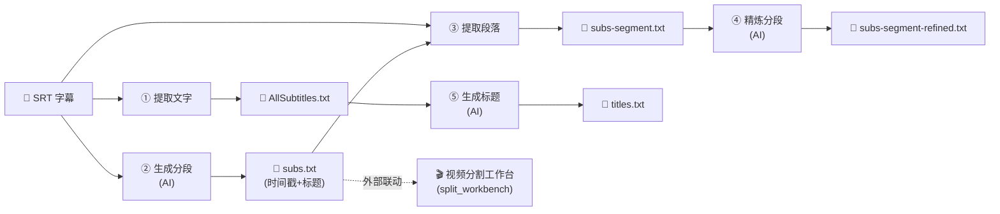

# 字幕处理综合工作台

把字幕菜单下多个独立窗口合并为一个工作台，对标 [split_workbench.py](../../src/tools/video/split_workbench.py)：一次载入 SRT，串联完成「提取文字 / 生成分段 / 提取段落 / 精炼分段 / 生成标题」全流程，避免用户在多个独立窗口间来回切换。老入口保留以便平滑迁移，稳定后再删。

> **2026-04 进展**：新增的菜单项「一键分段+精炼+标题（结构化）」（[srt_tools.py `SrtGeneratePackApp`](../../src/tools/subtitle/srt_tools.py)）已经把 ②③④⑤ 四个 AI 步骤的"快通道"用一次 `ai.complete_json()` 解决了，输出 1 份 JSON + 3 份 TXT。本工作台仍有价值（手工 review / 编辑 / 局部重跑 / 与视频分割工作台联动），但范围调整为：(a) 加载 pack 输出 JSON 直接进 review 模式；(b) 任意环节可单独重跑、手工编辑后再合成；(c) 与 split_workbench 联动。Router task 维度上，四个 AI 调用现已统一为 `task="subtitle.post"`。

---

## 数据流

---

## 现状盘点（已调研完成）

| 项 | 结论 |
|---|---|
| 待合并 App 数量 | **实际是 5 个**（BACKLOG 原文漏写"生成标题"） |
| 代码位置 | 全部在 [src/tools/subtitle/srt_tools.py](../../src/tools/subtitle/srt_tools.py) |
| AI 接入现状 | 3 个 AI 步骤已走 [core/srt_ops.py](../../src/core/srt_ops.py)（Router 化完成），但 srt_tools.py 里仍有冗余 prompt 副本（与 BACKLOG「Prompt 集中管理」P1 相关的技术债） |
| Router 管理按钮 | 3 个 AI App 各带一个，合并后只需 1 个（与 BACKLOG「Router 改为 Hub Tab」P1 相关） |
| 菜单注册 | [src/VideoCraftHub.py:339-350](../../src/VideoCraftHub.py#L339-L350) Subtitle 菜单下 5 项 |

### 5 个 App 明细

| # | 类名 | 菜单 key | 输入 | 输出 | AI? |
|---|------|---------|------|------|-----|
| 1 | `SrtExtractSubtitlesApp` | `srt-extract-subtitles` | SRT | `AllSubtitles.txt` | ❌ |
| 2 | `SrtGenerateSegmentsApp` | `srt-gen-segments` | SRT + prompt | `subs.txt` | ✅ |
| 3 | `SrtExtractParagraphsApp` | `srt-extract-paragraphs` | SRT + `subs.txt` | `subs-segment.txt` | ❌ |
| 4 | `SrtRefineSegmentsApp` | `srt-refine` | `subs-segment.txt` + prompt | `subs-segment-refined.txt` | ✅ |
| 5 | `SrtGenerateTitlesApp` | `srt-gen-titles` | `AllSubtitles.txt` + prompt | `titles.txt` | ✅ |

---

## 架构参考（可复用）

| 参考点 | 文件 | 说明 |
|---|---|---|
| 工作台范式 | [src/tools/video/split_workbench.py](../../src/tools/video/split_workbench.py) | 三段式布局 + Treeview + 嵌入播放器 + 异步运行 |
| 工具基类 | [src/tools/base.py](../../src/tools/base.py) `ToolBase` | 继承即可接入 Tab 状态圆点（idle/running/done/error） |
| 工具注册 | [src/VideoCraftHub.py](../../src/VideoCraftHub.py) `TOOL_MAP` | 新增工作台加一行；老的 5 个 key 暂不删 |
| 菜单注册 | [src/VideoCraftHub.py](../../src/VideoCraftHub.py) Subtitle 菜单 | 顶部加「字幕处理综合工作台」+ 分隔线 + 保留 5 个老入口 |
| i18n | `src/i18n/{zh,en}.json` | 新 key 加到两边，`tr("...")` 调用；Phase 1-7 已 806 keys |
| Router 入口 | Router 已是 Hub Tab（`AIConsoleApp`，2026-04 落地），工作台不再需要独立 Router 按钮 |

---

## 待决策点（用户需想清楚）

1. **合并范围**：5 合 1（含「生成标题」）还是严格 4 合 1（不含）？
   - 5 个同文件同质，一起并入更彻底；但会超出 BACKLOG 原定范围。

2. **UI 形态**：三选一
   - A. **左右分栏 + 步骤清单**：顶部 SRT 载入；左侧 5 步骤带状态圆点；右侧当前步骤 prompt/参数/输出预览；底部「运行当前 / 运行到此 / 运行全部」。风格对齐 split_workbench。
   - B. **顶部共享 SRT + `ttk.Notebook` 5 子 Tab**：5 个原 App UI 直接搬进 Tab。工作量最小，但「串联」不显性。
   - C. **向导式流水线**：强制按顺序推进，上游产出自动做下游输入。体现管线但灵活度低（无法跳步单独跑）。

3. **跨工作台联动**：生成分段（②）产出 `subs.txt` 后，是否提供「→ 打开视频分割工作台」按钮？一键形成 `字幕 → 分段 → 视频分割` 闭环。

4. **Prompt 处理**：
   - a. 等 BACKLOG 的「Prompt 集中管理 + 用户自定义」P1 先落地再做（阻塞），
   - b. 还是先把硬编码字符串直接搬进工作台（不阻塞，Prompt 管理落地后再统一替换）？

5. **老入口删除时机**：工作台稳定多久（几周？一个版本？）后删除 5 个老菜单项？是否保留 TOOL_MAP 条目作为调试/回退入口？

6. **输出目录策略**：5 步产出的 5 个文件是否统一放到工作台顶部指定的「输出目录」？还是沿用「输出到源 SRT 同目录」的现状？

---

## 关联 BACKLOG 项

- **Prompt 集中管理 + 用户自定义**（P1）：消除 srt_tools.py 里 prompt 重复副本；工作台 prompt 编辑区应对接统一 prompt 库。
- **AI Router Manager 改为 Hub 内 Tab**（P1）：工作台里的 Router 入口按新范式激活/新建 tab。
- **视频分割综合工作台**（✅ 已完成）：本工作台可作参考模板，并可选做跨工作台联动入口。
