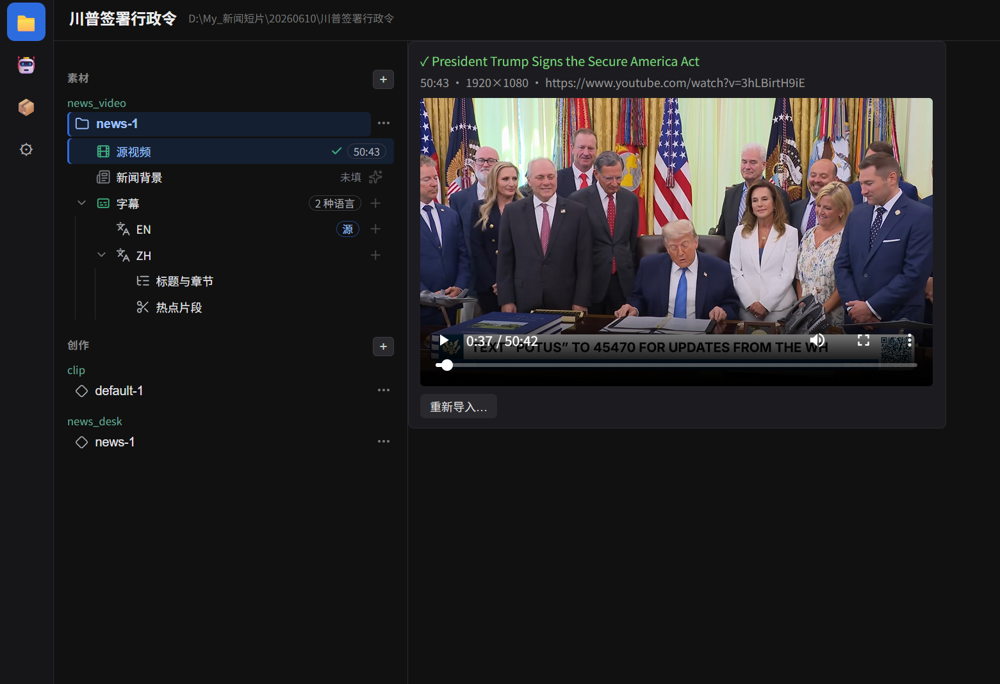

import { Card, CardGrid } from '@astrojs/starlight/components';

*The project hub: one source video per project, subtitles and chapters as materials, creations derived from them. (Screenshots show the Chinese UI — the app ships with both English and Chinese, hot-switchable.)*

## What it does

<CardGrid>
  <Card title="Clip" icon="seti:video">
    Batch-cut short videos from subtitle hotclips — pick the moments, get a batch of ready-to-post clips.
  </Card>
  <Card title="News Desk Video" icon="document">
    Turn news / speech / press-briefing footage into a finished video with bilingual subtitles, lower-third name plates, and a chapter strip.
  </Card>
  <Card title="Full subtitle pipeline" icon="pencil">
    Speech-to-text (ASR), SRT import, translation, quality-check with auto-fix, and styled burn-in (font / color / size / position / stroke / background).
  </Card>
  <Card title="Works out of the box" icon="rocket">
    ffmpeg ships inside the installer. The core video features need **no account and no API key**.
  </Card>
  <Card title="AI optional — three tiers" icon="setting">
    Built-in local models (offline, no key), your self-hosted [aistack](https://github.com/dosmoon/aistack) gateway, or your own cloud API keys. Pick any tier, mix freely, skip all of it.
  </Card>
  <Card title="Portable per-user install" icon="laptop">
    No admin rights needed. Installs per-user and keeps its data right beside the app — move the whole folder freely.
  </Card>
</CardGrid>

## Get started

1. [Download & install](download/) — Windows 10 / 11, 64-bit.
2. [Quick start](quick-start/) — from a video link to a finished video in six steps.

> ⚠️ **Early stage** (`0.x`) — features are evolving fast. Feedback is welcome via [GitHub Issues](https://github.com/dosmoon/VideoCraft/issues).

VideoCraft is open source under the [MIT License](https://github.com/dosmoon/VideoCraft/blob/main/LICENSE), maintained by [dosmoon](https://dosmoon.com/).
