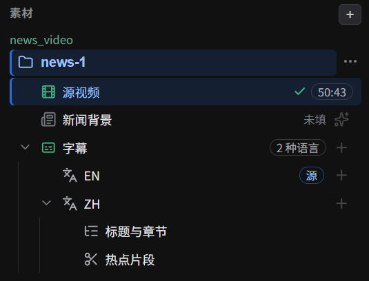
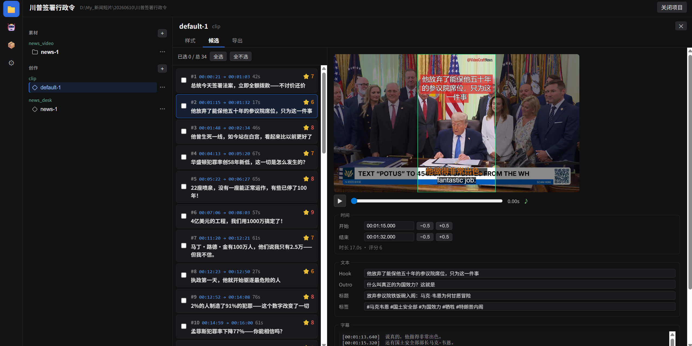
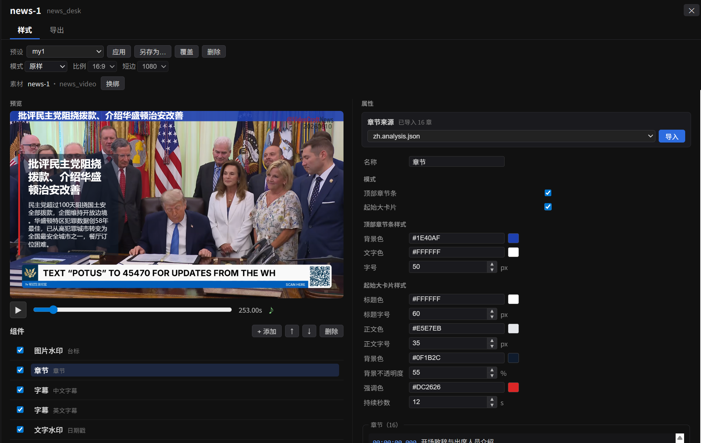
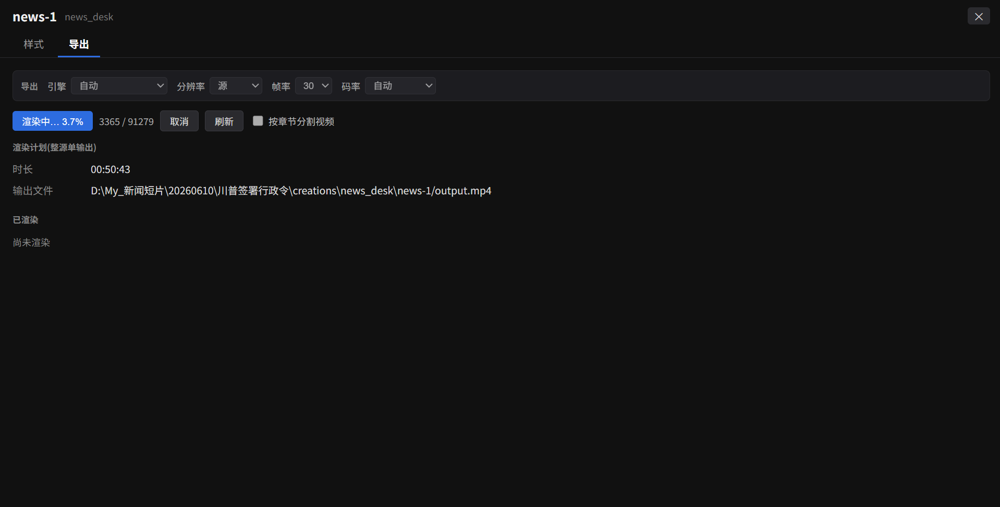
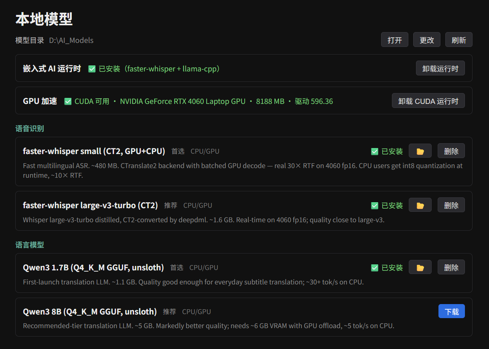

VideoCraft 的工作流是：

> **新建项目 → 添加素材（源视频 + 字幕 + 章节）→ 生成创作（切片 / 新闻编导视频）**

## 六步出片

1. **新建项目**。
2. 添加 **「新闻视频」素材**：粘贴视频链接（内置 yt-dlp 下载）或选择本地文件；可选裁到指定时间段。
3. **字幕**：一键 **ASR 语音转字幕** / **导入 SRT** / **翻译** / **质检并自动修复**。
4. （可选）整理 **章节**，或填 **AI 新闻背景**（主持人、事件、要点等 15 字段，可让 AI 联网补全后人工校正）。
5. **生成创作出片**：
   - **切片** —— 基于字幕热点片段，批量切出短视频；
   - **新闻编导视频** —— 双语字幕 + 名牌 + 章节条的完整成片。
6. 配置样式（字幕 / 文字水印 / 图片水印 / 开场·结尾卡片 / 章节条）→ **渲染导出**。

## 界面一览

*项目的素材树 —— 一条源视频、双语字幕、章节与热点片段。*

*切片工作台 —— 左侧勾选热点片段候选，右侧实时预览带样式的短视频。*

*新闻编导工作台 —— 双语字幕 + 名牌 + 章节条，样式调整实时反映在预览里。*

*渲染导出 —— 选择引擎 / 分辨率 / 帧率 / 码率，可选按章节分割输出。*

## 关于 AI（可选，绝不强制）

核心出片不需要 AI。当你需要 ASR / 翻译 / 分析时，在 **AI** 与 **模型** 面板里按需启用，三档任选、可混用：

- **内置本地** —— 在 **模型管理器**里一键下载本地模型（如 faster-whisper），离线运行、无需任何 Key；
- **自建 [aistack](https://github.com/dosmoon/aistack)** —— 指向你自己部署的网关；
- **云端 API** —— 填入你自己的 Key（Gemini / DeepSeek / Groq / LemonFox 等），按用量直接向服务方付费，VideoCraft 不收任何中间费用。

可选 **GPU 加速**（在模型管理器里安装 CUDA 运行时）。所有下载与配置都是强引导但**可跳过**。

*模型管理器 —— 嵌入式 AI 运行时、GPU 加速、本地模型，全部一键安装。*
